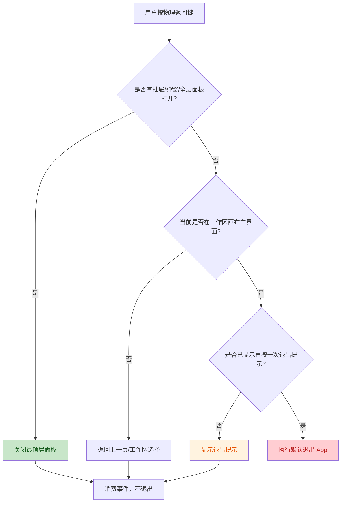

# Task 2：移动端代码审查报告

**审查范围**：`client/src/hooks/*`、`client/src/components/Layout/MainLayout.tsx`、`client/src/components/Chat/ChatPanel.tsx`、`client/src/components/Canvas/CanvasPage.tsx`、`client/src/components/Canvas/NodeContextMenu.tsx`、`client/src/components/Settings/*`、`client/src/components/Feedback/FeedbackModal.tsx`、`client/src/components/Workspace/*`、`client/src/services/pushService.ts`、`client/src/services/mobileService.ts`  
**参考规范**：`.trae/specs/optimize-mobile-footer-icp/spec.md`  
**审查时间**：2026-06-19  
**审查结果汇总**：共发现移动端相关问题 **16 项**，其中 **阻塞级 5 项、严重级 5 项、一般级 6 项**。

---

## 1. 各检查项通过状态

| 序号 | 检查项 | 通过状态 | 备注 |
|------|--------|----------|------|
| 1 | `client/src/hooks/useBackButton.ts` | 不通过 | Hook 本身可注册/卸载，但消费侧未实现“面板优先关闭→页面返回→退出”的层级逻辑；`useDoublePressExit` 与 `App.tsx` 的工作区返回处理器存在优先级冲突。 |
| 2 | `client/src/hooks/useMobile.ts` / `useIsMobile.ts` | 不通过 | `useMobile.ts` 功能正常；`useIsMobile.ts` 仅依赖 `window.innerWidth < 768`，无法区分 Capacitor App 与移动浏览器，首屏也会产生桌面布局闪屏。 |
| 3 | `client/src/hooks/useLongPress.ts` | 不通过 | 同时绑定鼠标与触摸事件，触屏设备上易重复触发；touchmove 任意偏移即取消长按；未阻止默认浏览器菜单。 |
| 4 | `client/src/components/Layout/MainLayout.tsx` | 不通过 | 已按 `optimize-mobile-footer-icp` 规范将备案信息收进抽屉；但未处理物理返回键关闭抽屉/全层面板，移动端聊天/历史/消息中心等全屏页未做软键盘适配。 |
| 5 | `client/src/components/Chat/ChatPanel.tsx` | 不通过 | 在移动端的宽度/高度基本可用，但输入框位于固定底部，软键盘弹起时存在被遮挡风险；消息复制按钮的长按实现不够稳健。 |
| 6 | `client/src/components/Canvas/CanvasPage.tsx` / `NodeContextMenu.tsx` | 不通过 | 支持双指缩放/单指平移；节点长按依赖 `useLongPress`，存在与点击冲突及浏览器默认菜单问题；顶部移动端工具栏在小屏可能溢出；右键菜单外部点击未兼容 touch。 |
| 7 | `client/src/components/Settings/SettingsModal.tsx` / `APIConfigPanel.tsx` / `UISettingsPanel.tsx` | 部分通过 | 移动端已全屏/居中适配，按钮尺寸基本可用；`SettingsModal.tsx` 在 effect 中直接 `setState`，违反 hooks 规则并触发 lint error。 |
| 8 | `client/src/components/Feedback/FeedbackModal.tsx` | 通过 | 移动端全屏弹窗，表单区域可滚动，按钮区域可点击。 |
| 9 | `client/src/components/Workspace/WelcomePage.tsx` / `WorkspaceSettingsModal.tsx` | 部分通过 | 移动端排版整体可用；`WorkspaceSettingsModal.tsx` 的广播接口使用裸 `fetch` 且未走统一 API 实例，认证/跨域可能在 App 内失效。 |
| 10 | `client/src/services/pushService.ts` | 待验证 | 极光推送初始化、事件监听、设备注册代码结构正确；但厂商通道未集成、权限申请 API 需要真机验证、前台通知未做本地展示。 |
| 11 | `client/src/services/mobileService.ts` | 通过 | 返回键/网络/震动/状态栏/常亮等原生能力封装正确；存在 `any` 类型违规，平台检测方式可更健壮。 |

---

## 2. 问题清单（按严重程度分级）

### 2.1 阻塞级

#### B1：物理返回键未按“面板 → 页面 → 退出”层级处理
- **涉及文件**：`client/src/components/Layout/MainLayout.tsx`（全局面板状态）、`client/src/App.tsx`（第 76-88 行）、`client/src/hooks/useBackButton.ts`
- **现象**：`MainLayout` 中抽屉、全屏聊天、历史、消息中心、搜索、文件面板、设置、反馈、工作区设置等状态均未通过 `useBackButton` 注册返回键消费逻辑。`App.tsx` 注册了一个高优先级的返回处理器：当存在 `currentWorkspace` 时直接清空当前工作区并返回欢迎页；而 `useDoublePressExit` 注册顺序在前，导致进入工作区后双次退出提示永远不会触发。
- **影响**：用户在移动端打开侧边栏/聊天/设置等面板时按物理返回键，会直接退出工作区甚至退出 App，无法先关闭面板；双次退出功能失效，严重影响导航体验和审核评分。
- **修复建议**：
  1. 在 `MainLayout` 中使用 `useBackButton` 按层级注册面板关闭逻辑：抽屉 → 工作区信息浮层 → 聊天/历史/消息中心/搜索/文件全屏页 → 设置/反馈/工作区设置弹窗。
  2. `App.tsx` 的“清空工作区”处理器应仅在所有面板均关闭、且当前不在欢迎页时执行，或将其注册为最低优先级。
  3. 统一使用 `useBackButtonAdvanced` 的 `registerHandler` 让各组件自行注册，确保后注册的先执行（栈顶优先）。

#### B2：移动端聊天面板输入框存在被软键盘遮挡的风险
- **涉及文件**：`client/src/components/Layout/MainLayout.tsx`（第 896-914 行）、`client/src/components/Chat/ChatPanel.tsx`（第 1744-1815 行输入区域）
- **现象**：移动端聊天使用 `fixed inset-0 z-50 bg-dark-950 flex flex-col` 全屏容器，输入区域固定在底部；代码中没有任何 `visualViewport`、`-keyboard-inset` 或 `window.innerHeight` 监听逻辑。
- **影响**：在 Android WebView/Capacitor 中若 `android:windowSoftInputMode` 未设置或设置不当，键盘弹起不会挤压视口，导致输入框被键盘覆盖，用户无法看到输入内容。
- **修复建议**：
  1. 监听 `window.visualViewport` 的 `resize` 事件，计算键盘高度并给输入容器增加底部 padding 或滚动消息列表到底部。
  2. 在 `AndroidManifest.xml` 中确认 `MainActivity` 的 `windowSoftInputMode` 为 `adjustResize`。
  3. 使用 `100dvh` 或 `window.innerHeight` 动态设置容器高度，确保键盘弹起后布局可压缩。

#### B3：`useLongPress` 同时绑定鼠标与触摸事件，触屏设备易产生重复触发
- **涉及文件**：`client/src/hooks/useLongPress.ts`（第 50-66 行）、`client/src/components/Canvas/CanvasPage.tsx`（第 156-178 行节点使用）
- **现象**：`useLongPress` 同时返回 `onMouseDown/Up/Leave` 与 `onTouchStart/End/Move/Cancel`。在触屏设备上，浏览器通常会先触发 touch 事件，再模拟触发 mouse 事件；由于未调用 `preventDefault()`，同一操作会触发两套事件，导致定时器重复创建、`onClick` 可能被调用两次。
- **影响**：节点长按菜单弹出后可能伴随一次额外的点击事件，造成误选中/误操作；与 ReactFlow 的 `onNodeClick` 叠加后体验不可控。
- **修复建议**：
  1. 在 touch 事件处理中调用 `e.preventDefault()` 阻止鼠标模拟事件（注意在事件处理函数上不能声明 `passive: false` 时 React 可能警告，需通过 CSS `touch-action: none` 配合）。
  2. 或在 `start` 中检测 `e.nativeEvent.touches` 存在时忽略后续的 mouse 事件，避免重复计时器。
  3. 给使用长按的元素添加 `touch-action: none; user-select: none; -webkit-user-select: none;`。

#### B4：极光推送缺少厂商通道集成
- **涉及文件**：`client/src/services/pushService.ts`（第 96-238 行）
- **现象**：`PushClientService.initialize` 仅调用 `JPush.startJPush()`、注册事件、获取 `registrationId` 并上报后端；代码中没有任何华为、小米、OPPO、vivo、荣耀等厂商通道（Manufacturer Channel）初始化或配置。
- **影响**：在中国大陆 Android 生态中，缺少厂商通道会导致 App 被杀后台后推送无法送达，严重影响消息中心、广播、强制阅读等核心功能。
- **修复建议**：
  1. 确认 `capacitor-plugin-jpush` 是否已内置厂商通道集成；如未内置，需引入对应厂商 SDK 并在 `android/app/build.gradle`、`AndroidManifest.xml` 中配置 `JPUSH_APPKEY`、`JPUSH_CHANNEL`、各厂商 AppID/Secret。
  2. 在 `PushClientService` 中增加厂商 token 获取与上报逻辑（如插件提供 `JPush.getVendorRegistrationID` 等 API）。
  3. 在 `pushService.ts` 中补充错误处理与重试机制。

#### B5：推送权限申请 API 与事件名需要真机验证
- **涉及文件**：`client/src/services/pushService.ts`（第 128-133 行、第 110-120 行）
- **现象**：代码使用 `JPush.checkPermissions()` 获取 `{ permission }`，并在 `permission !== 'granted'` 时调用 `JPush.requestPermissions()`；监听事件名为 `notificationReceived` 与 `notificationOpened`。
- **影响**：`capacitor-plugin-jpush` 各版本的 API 命名可能存在差异（例如事件名可能是 `pushReceived`、`notificationClick`、`requestPermission` 等）。若 API 不匹配，初始化或权限申请会静默失败。
- **修复建议**：
  1. 在真机/模拟器上运行 `npx cap run android`，确认 `checkPermissions` 返回结构、事件名、回调参数与文档一致。
  2. 为所有 `JPush.xxx` 调用包裹 `try/catch` 并输出日志，避免初始化失败导致后续逻辑中断。
  3. 对 Android 13+ 确认 `AndroidManifest.xml` 已声明 `POST_NOTIFICATIONS` 权限。

---

### 2.2 严重级

#### S1：`useIsMobile` 无法区分 Capacitor App 与移动浏览器
- **涉及文件**：`client/src/hooks/useIsMobile.ts`（第 8-26 行）
- **现象**：仅通过 `window.innerWidth < 768` 判断移动端，没有 `Capacitor.isNativePlatform()` 或 `navigator.userAgent` 检测。
- **影响**：无法针对原生 App 做差异化处理（例如状态栏高度、返回键、软键盘、推送等）；平板横屏会被误判为桌面端。
- **修复建议**：
  1. 保留宽度判断作为响应式依据。
  2. 新增 `useIsNativeApp` Hook 基于 `Capacitor.isNativePlatform()` 判断原生平台；需要原生能力时优先使用 `useMobile().isNative`。
  3. 在 `useIsMobile` 中增加 `window.matchMedia('(pointer: coarse)').matches` 等辅助判断，提高平板/折叠屏识别率。

#### S2：`NodeContextMenu` 仅监听 `mousedown`，移动端点击遮罩外可能无法关闭
- **涉及文件**：`client/src/components/Canvas/NodeContextMenu.tsx`（第 37-54 行）
- **现象**：外部点击关闭逻辑仅订阅 `document.mousedown`，未处理 `touchstart`。
- **影响**：在触屏设备上，手指点击菜单外部时，`mousedown` 事件滞后或可能不触发，导致菜单无法关闭。
- **修复建议**：将 `mousedown` 替换为 `pointerdown`，或同时监听 `touchstart` 与 `mousedown`。

#### S3：`CanvasPage` 顶部移动端工具栏在小屏下可能溢出
- **涉及文件**：`client/src/components/Canvas/CanvasPage.tsx`（第 784-886 行移动端工具栏）
- **现象**：工具栏容器使用 `flex items-center gap-1 p-2`，包含 8 个固定按钮 + “更多”下拉，没有 `flex-wrap` 或横向滚动。
- **影响**：在 320-360px 宽度的低端 Android 手机上，工具栏按钮会被挤到可视区域外，影响画布核心操作。
- **修复建议**：
  1. 给工具栏外层增加 `flex-wrap` 或 `overflow-x-auto`。
  2. 将低频操作（关系、多选、聚合、自动布局、撤销/重做）进一步收纳进“更多”菜单，保证首行只保留新建/分支/编辑/删除/同步。

#### S4：`App.tsx` 工作区返回处理器屏蔽了双次退出提示
- **涉及文件**：`client/src/App.tsx`（第 34 行、第 76-88 行）
- **现象**：`useDoublePressExit` 先注册，`useBackButton` 后注册；`useBackButton` 的 handler 在有 `currentWorkspace` 时直接返回 `true`，导致 `useDoublePressExit` 永远没有机会执行。
- **影响**：用户在工作区内无法通过“再按一次退出”安全退出 App，而是直接返回工作区选择页。
- **修复建议**：将双次退出处理器作为最高优先级（最后注册），并仅在所有面板关闭且当前不在欢迎页/设置页时生效；工作区返回逻辑应降级为次优先级。

#### S5：画布节点长按未阻止默认浏览器菜单
- **涉及文件**：`client/src/hooks/useLongPress.ts`、`client/src/components/Canvas/CanvasPage.tsx`（第 156-178 行）
- **现象**：`useLongPress` 在 `onTouchStart` 中未调用 `preventDefault()`，节点也没有 `onContextMenu` 阻止默认或 CSS 禁用选择。
- **影响**：Android 浏览器/WebView 长按节点时，系统上下文菜单（复制/搜索/分享）可能与自定义菜单同时弹出，遮挡或冲突。
- **修复建议**：
  1. 在节点容器上添加 `onContextMenu={(e) => e.preventDefault()}`。
  2. 添加 CSS `user-select: none; -webkit-touch-callout: none;`。
  3. 在 `useLongPress.start` 中识别 touch 后主动 `preventDefault()` 阻止系统菜单。

---

### 2.3 一般级

#### G1：`mobileService.ts` 使用 `any` 类型且平台检测方式可优化
- **涉及文件**：`client/src/services/mobileService.ts`（第 45 行、第 54 行）
- **现象**：`(window as any).Capacitor?.isNativePlatform?.()` 和 `status: any` 直接使用了 `any`。
- **影响**：违反项目 TypeScript 规范（禁止 `any`），且依赖全局 `window.Capacitor` 注入时机。
- **修复建议**：从 `@capacitor/core` 导入 `Capacitor`，使用 `Capacitor.isNativePlatform()` 与 `Capacitor.getPlatform()`；网络状态使用 `NetworkStatus` 类型。

#### G2：前台收到推送通知仅打印日志，未展示本地通知
- **涉及文件**：`client/src/services/pushService.ts`（第 110-112 行）
- **现象**：`notificationReceived` 事件仅 `console.log`，没有调用本地通知展示。
- **影响**：App 在前台时，用户可能完全看不到推送内容。
- **修复建议**：集成 `@capacitor/local-notifications` 或在 `notificationReceived` 中调用 `JPush.setBadgeNumber`/`localNotification` 等能力，确保前台消息可感知。

#### G3：`useBackButton.ts` import 顺序不合理
- **涉及文件**：`client/src/hooks/useBackButton.ts`（第 1-2 行、第 144 行）
- **现象**：`useState`、`useRef` 的 import 被放在文件末尾（第 144 行），在函数定义之后。
- **影响**：虽然 ES Module 会提升 import，但可读性差，易引起维护困惑，部分构建/检查工具可能警告。
- **修复建议**：将所有 import 统一移到文件顶部。

#### G4：`ChatPanel` 消息复制按钮长按定时器未在 `touchmove` 时取消
- **涉及文件**：`client/src/components/Chat/ChatPanel.tsx`（第 109-126 行）
- **现象**：`handleTouchStart` 启动 500ms 定时器，`handleTouchEnd` 取消；但没有监听 `touchmove`。
- **影响**：用户手指轻微滑动（如滚动消息列表时误触复制按钮）仍会触发复制。
- **修复建议**：增加 `onTouchMove` 取消定时器，或复用更健壮的 `useLongPress` Hook。

#### G5：`SettingsModal.tsx` 在 effect 中直接调用 `setState`
- **涉及文件**：`client/src/components/Settings/SettingsModal.tsx`（第 27-31 行）
- **现象**：`useEffect(() => { if (isOpen && initialTab) setActiveTab(initialTab); }, [isOpen, initialTab])`。
- **影响**：触发 `react-hooks/set-state-in-effect` lint error，可能导致额外渲染。
- **修复建议**：将 `initialTab` 通过 props 直接受控，或在打开弹窗时由调用方通过 state 初始化，避免在 effect 中 setState。

#### G6：备案信息组件引用远程图片
- **涉及文件**：`client/src/components/Layout/MainLayout.tsx`（第 62 行）
- **现象**：`` 直接引用外部图片。
- **影响**：弱网或离线环境下图片无法加载，影响合规展示。
- **修复建议**：将公安备案图标下载到项目 `public` 目录，使用相对路径引用。

---

## 3. 推荐修复后的返回键处理流程

---

## 4. Lint 验证参考

在 `client` 目录执行 `npm run lint` 后，本次审查涉及文件存在以下错误或警告（节选）：

- `client/src/services/mobileService.ts`：第 45、54 行 `Unexpected any`。
- `client/src/services/pushService.ts`：第 114 行 `Unexpected any`。
- `client/src/components/Settings/SettingsModal.tsx`：第 29 行 `Avoid calling setState() directly within an effect`。
- `client/src/components/Canvas/CanvasPage.tsx`：第 364 行 `React Hook useMemo has a missing dependency: 't'`。
- `client/src/components/Chat/ChatPanel.tsx`：第 372 行 `messages` 依赖相关 warning。

> 完整输出见本次执行日志（`npm run lint` 共 34 errors / 7 warnings）。这些问题虽不全是移动端功能缺陷，但会阻塞后续构建与发布流程，建议在修复移动端问题时同步处理。

---

## 5. 总体结论与下一步建议

1. **优先修复阻塞级问题**：返回键层级（`MainLayout` + `App.tsx`）、聊天软键盘适配（`MainLayout`/`ChatPanel`）、`useLongPress` 触屏冲突、`pushService` 厂商通道与权限验证。
2. **同步处理严重级问题**：`useIsMobile` 原生识别、`NodeContextMenu` touch 关闭、画布工具栏小屏溢出、`App.tsx` 双次退出失效、节点默认菜单阻止。
3. **代码质量修复**：消除 `any`、调整 import 顺序、修复 `SettingsModal` effect setState、下载备案图标到本地。
4. **验证方式**：
   - Web 端：`npm run lint` 无错误、`npm run build` 成功。
   - Android 端：`npx cap sync android` 成功，真机/模拟器验证抽屉返回、聊天输入、节点长按菜单、推送到达与点击。

---

*报告生成路径*：`d:\study1\DeepMindMap\v2\.trae\specs\check-fix-capacitor-mobile-and-guide-filing\report-task2.md`
